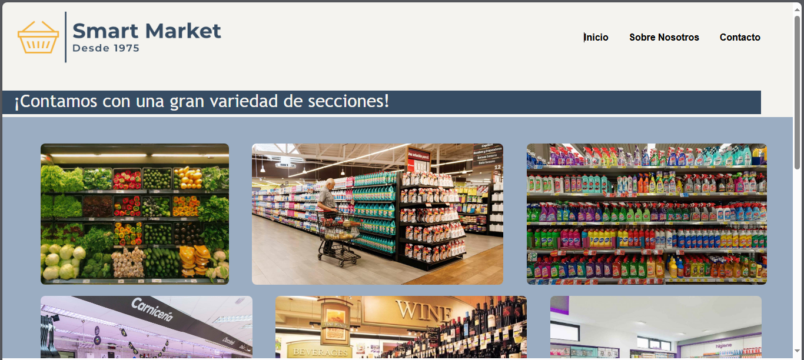
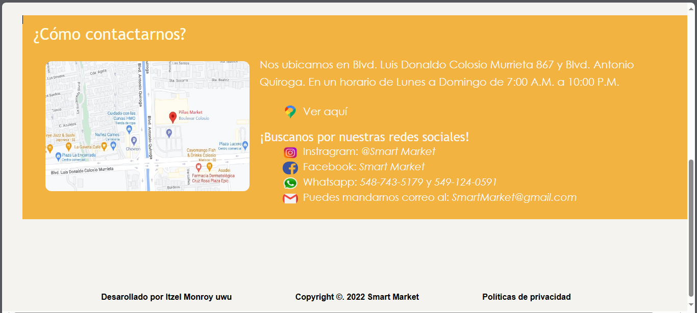
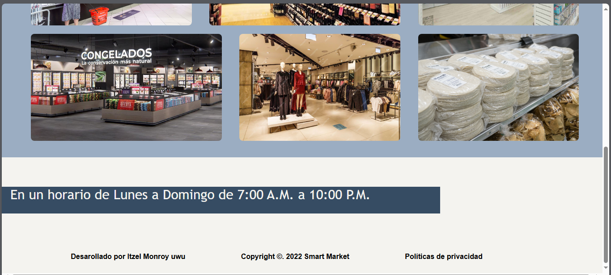

# Pagina-de-un-supermercado
Página web sencilla de un supermercado, creada con HTML y CSS. Incluye secciones como contacto y datos, además de estilos y recursos gráficos.

---

## Tecnologías / Lenguajes usados
- **HTML** (estructura de las páginas)
- **CSS** (diseño y estilos)

> Desglose aproximado en el repositorio (por bytes): HTML (7293), CSS (4543).

---

## Estructura del proyecto (archivos principales)

### Páginas HTML
- `ProyecSub1.html`  
  Página principal del proyecto (inicio/estructura principal del sitio).
- `Contacto.html`  
  Sección/página de contacto.
- `Datos.html`  
  Sección/página de datos/información.

### Estilos (CSS)
- `inicio.css`  
  Estilos para la página principal (o sección de inicio).
- `estilocontacto.css`  
  Estilos para la página de contacto.
- `estilodatos.css`  
  Estilos para la página de datos.

---

## Cómo ejecutar el proyecto (local)
1. Descarga o clona este repositorio.
2. Abre el archivo `ProyecSub1.html` en tu navegador (doble clic o “Open with…”).
3. Navega a las demás secciones desde los enlaces internos (si están configurados en el HTML).

> Recomendación: si alguna imagen o CSS no carga, revisa que las rutas (paths) en el HTML coincidan exactamente con los nombres (incluyendo mayúsculas/minúsculas).

---

## Sección de imágenes (capturas)
A continuación algunas vistas del proyecto:

### Vista 1

### Vista 2

### Vista 3

---

## Autor
- Itzel921

---

## Estado del proyecto
Proyecto básico/educativo para práctica de maquetación web con HTML y CSS.
